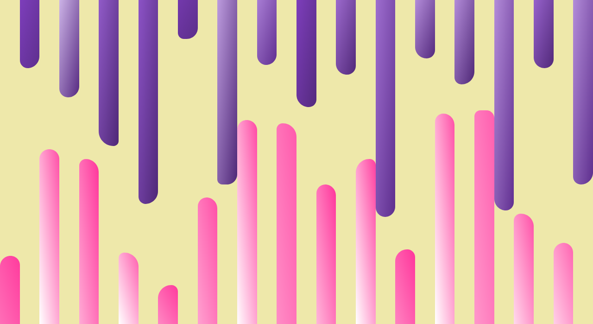

# Random Bars

Let's create some random bars with SASS.

We can make use of [SASS loops](https://sass-lang.com/documentation/at-rules/control/for), `:nth-child` and the `random()` function that is built-in SASS. 

Next, let's animate the bars to increase their height, but randomize the speed.

> Note: have a look into [`transform-origin`](https://developer.mozilla.org/en-US/docs/Web/CSS/transform-origin).